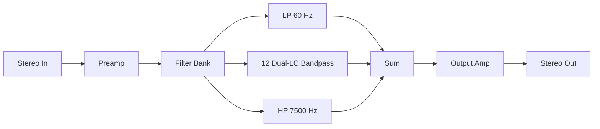
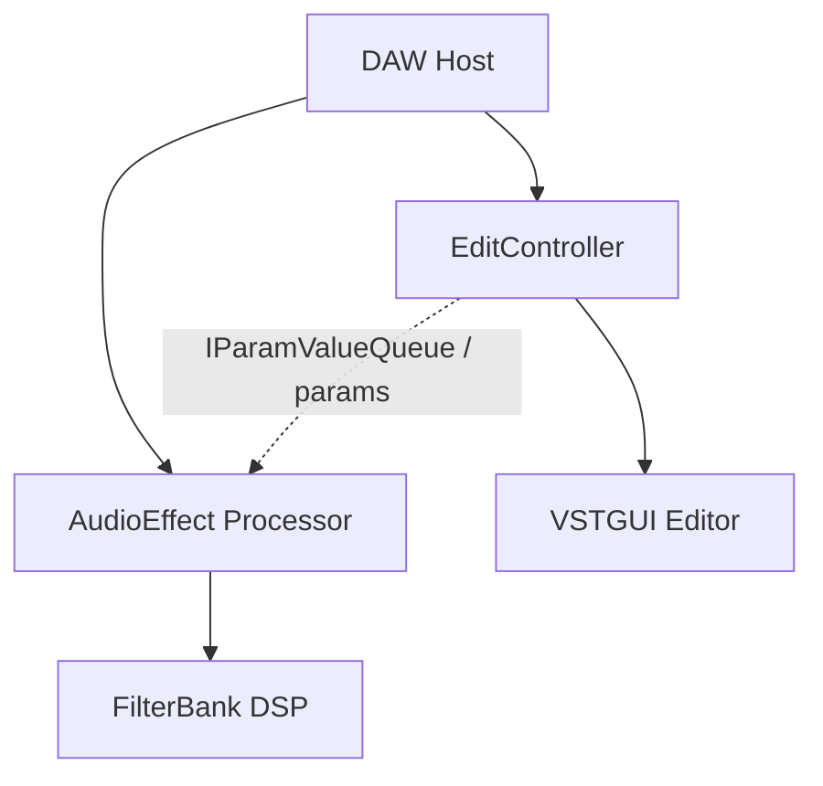

# Dual-LC VST3 Filterbank

## Scope lock

- **New GitHub repository and Cursor workspace.** Do not add plugin code to the current Enigma CW Console tree (`/workspace`). This agent cannot create GitHub repos (`gh` is read-only here). After you confirm, create an empty repo (proposed name: `dual-lc-filterbank`) and open it as the new workspace; implementation happens there.
- **SDK only:** [Steinberg VST3 SDK](https://github.com/steinbergmedia/vst3sdk) (processor + `IEditController`) and **VSTGUI** bundled with that SDK. No Qt, no JUCE, no other GUI toolkit.
- **C++17**, CMake, 64-bit. Primary target **Windows (MSVC 2022)**; Linux/macOS builds kept working for CI and this cloud environment.
- Stereo in/out, linked channels. No oversampling in v1.

## Signal flow




Topology is a **parallel inductor-bank graphic EQ** (vintage LC graphic cards), not a series of digital peaking EQs:

- Preamp feeds all cells.
- Each cell is a dual-LC network with a bipolar **gain** mix into the summer.
- All cell gains at 0 dB yields **unity** (dry path + cancelled boost/cut).
- Output amp is makeup/trim to digital line level (unity default; 0 dBFS FS, operate around -18 dBFS ≈ +4 dBu).

## Frequency grid (14 cells)

True octaves from 60 Hz to 7500 Hz only span ~7 steps. Locked layout: **half-octave graphic** covering that range.

- **Low-pass** cutoff: **60 Hz**
- **Bandpass** centers (Hz): **85, 120, 170, 240, 340, 480, 680, 960, 1360, 1920, 2720, 3840**
- **High-pass** cutoff: **7500 Hz**
- Fixed **Q = 0.8** on every cell

## Dual-LC cell model

Each bandpass cell is a **constant-K dual network** (series LC arm + dual shunt LC arm), not a generic cookbook biquad:

- Analog prototype: series resonator `L1-C1` and dual parallel resonator `L2-C2`, `ω0 = 1/√(LC)`, Q from termination resistance so **Q ≈ 0.8**.
- LP/HP cells use the matching constant-K low-pass / high-pass dual-LC prototypes at 60 Hz / 7500 Hz, same Q.
- Discretize with **bilinear transform + cutoff prewarp** at the cell’s `fc`. Rebuild coefficients on sample-rate change (44.1 / 48 / 88.2 / 96 kHz).
- Per-cell **gain** is a linear mix around the tank (boost adds band energy, cut subtracts), range **±12 dB**, 0 dB = no contribution.
- v1 is linear L/C. Leave a single `process()` hook so inductor saturation can be added later without changing the VST3 surface.

Preamp and output amp are analog-style gain stages: linear gain plus a gentle tanh saturator so hot preamp settings clip more like a line amp than a digital brickwall.

## VST3 architecture

Steinberg split: audio on the processor, UI on the controller. Parameters are the only thread-safe bridge.




Parameters (all automatable):

- `cell_gain[0..13]` — 14 knobs, ±12 dB
- `preamp_gain` — 0 to +24 dB (default 0)
- `output_gain` — ±12 dB (default 0)

No other GUI libraries. Editor is VSTGUI: two rows of analog-style knobs, frequency labels, preamp + output on the right, plugin name/logo strip.

## New repository layout

```
dual-lc-filterbank/
  CMakeLists.txt
  README.md
  cmake/           # VST3 SDK fetch/submodule helpers
  src/plugin/      # factory, processor, controller, version
  src/dsp/         # dual_lc_cell, filter_bank, amplifiers
  src/gui/         # VSTGUI editor + .uidesc
  resources/       # moduleinfo.json, bitmaps
  tests/           # offline DSP tests (Catch2 or GoogleTest)
```

CMake uses the official SMTG helpers: build a `.vst3` bundle, `SMTG_CREATE_PLUGIN_LINK` into the local VST3 folder on Windows.

## Environment setup (first implementation work)

After the empty GitHub repo exists and this work is opened against that workspace:

1. Pin **CMake ≥ 3.25**, **C++17**, Windows **VS 2022 x64** as the documented path.
2. Add **vst3sdk** as a git submodule (`pluginterfaces`, `base`, `public.sdk`, `vstgui4`, `cmake`).
3. Scaffold a silent pass-through VST3 that loads in a host (validator / REAPER / Steinberg `validator`).
4. Add `tests/` that compile without a DAW: impulse/sine checks for Q, `fc`, and unity at 0 dB.
5. Document Windows: clone recursively, `cmake -G "Visual Studio 17 2022" -A x64`, build, copy `.vst3` to `%LOCALAPPDATA%\Programs\Common\VST3` (or SMTG link).
6. Keep a Linux Ninja build so CI and cloud agents can compile/test DSP without MSVC.

## Implementation order

1. **Repo + CMake + pass-through VST3** (environment).
2. **DSP library** with unit tests: dual-LC prototype, bilinear, 14-cell bank, pre/output amps, unity and Q checks.
3. **Processor** `process()`: denormal flush, per-sample or per-block coeff smooth (parameter smoothing ~10–20 ms).
4. **Controller + VSTGUI**: 14 interactive cell knobs + preamp + output; labels in Hz.
5. **pluginval** (or Steinberg validator) + README with Windows load instructions.

## Out of scope for v1

- Qt, JUCE, CLAP, VST2, AU
- Per-band Q knobs, solo/mute, analyzer
- Nonlinear inductor model (hook only)
- Changing the Enigma CW Console repository

